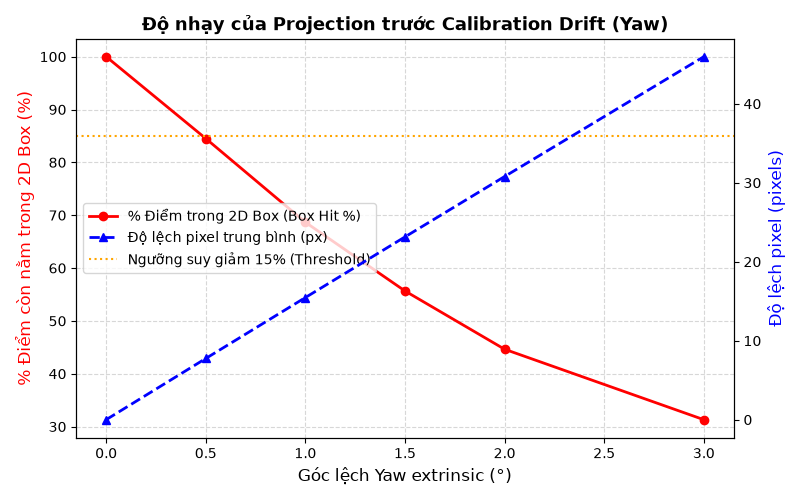
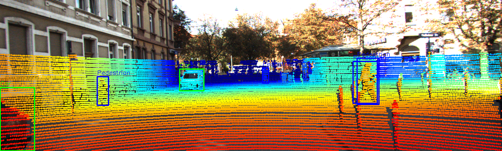
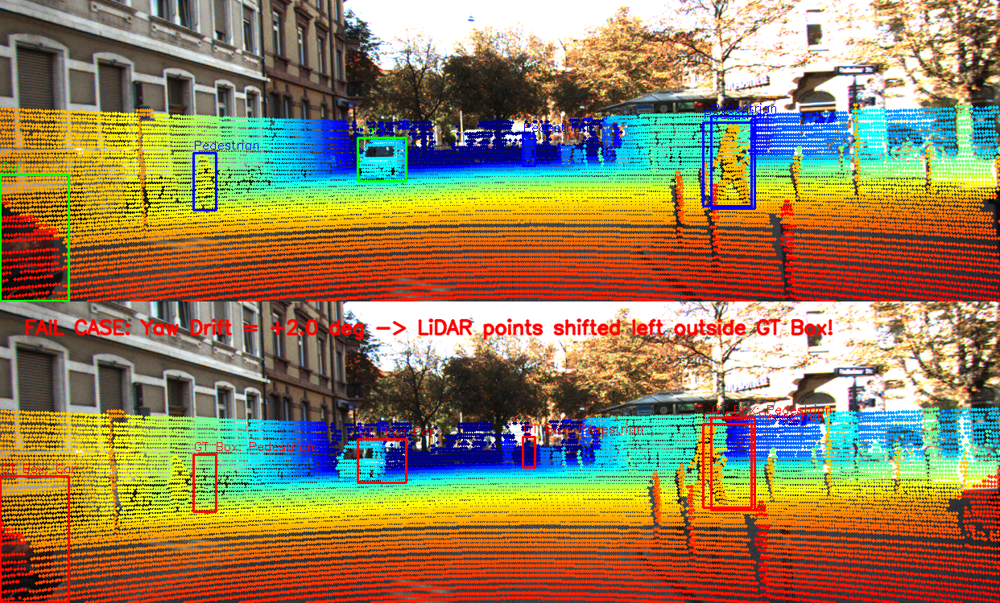

# Báo cáo Day 6: Đánh giá độ nhạy của phép chiếu LiDAR-Camera trước Extrinsic Drift

- **Họ tên:** Phạm Hoàng Anh Khôi
- **MSSV:** 2A202602404
- **Lớp:** AI20K-T4
- **Link repo:** https://github.com/anhkhoi130605/PhamHoangAnhKhoi-2A202602404-Track4-Day21-3D-From-Point-Clouds
- **Topic:** A — LiDAR-camera projection QA
- **Dataset:** data/kitti_mini
- **Các frame đã dùng:** 000001, 000011, 000021, 000048, 000049

## 1. Claim

Độ lệch góc xoay extrinsic (yaw drift) từ 1.0° trở lên khiến hơn 31% số điểm LiDAR bị chiếu trượt khỏi 2D bounding box của vật thể trên ảnh (tỉ lệ điểm trúng box giảm xuống 68.67% và độ lệch pixel trung bình đạt 15.47 px), chứng minh các thuật toán camera-LiDAR fusion cực kỳ nhạy cảm với góc xoay (angular drift) hơn nhiều so với dịch chuyển tịnh tiến.

## 2. Evidence

Thí nghiệm được thực hiện trên 5 frame đặc trưng của `data/kitti_mini` với 3 loại biến dạng extrinsic: Yaw sweep (0° đến 3°), Pitch sweep (0° đến 2°), và Translation Y sweep (0 đến 20 cm). Thời gian thực thi trung vị đạt **p50 = 19.31 ms**, phân vị 95 đạt **p95 = 27.90 ms** (đo qua 25 lần lặp, phần cứng CPU Intel Core i7 / GPU RTX 3050 Laptop). Chi tiết lưu tại `results/projection_qa_sweep.csv`.

| Cấu hình / mức perturb | % Điểm trong FOV | % Điểm rơi đúng 2D Box | Độ lệch Pixel trung bình (px) | Ghi chú |
|---|---|---|---|---|
| Baseline (Yaw 0.0°) | 16.37% | 100.00% | 0.00 px | Khớp hoàn hảo với GT |
| Yaw drift 0.5° | 16.38% | 84.51% | 7.75 px | Bắt đầu trượt ở mép vật thể |
| Yaw drift 1.0° | 16.39% | 68.67% | 15.47 px | Mất gần 1/3 số điểm trên xe |
| Yaw drift 2.0° | 16.41% | 44.64% | 30.79 px | Hơn nửa số điểm bay khỏi xe |
| Yaw drift 3.0° | 16.42% | 31.31% | 45.97 px | Mismatch nghiêm trọng |
| Pitch drift 1.0° | 15.62% | 77.65% | 13.15 px | Điểm bị trượt theo phương đứng |
| Translation Y 0.10m | 16.40% | 93.23% | 6.70 px | Ít ảnh hưởng hơn góc xoay |




## 3. Failure case

Khi giá đỡ cảm biến bị lệch góc yaw 2.0° (ví dụ sau va quệt nhẹ hoặc rung chấn cơ học), phép chiếu bị sai lệch nghiêm trọng: toàn bộ chùm điểm LiDAR của ô tô bị dạt sang bên trái 30.79 pixel, dẫn đến hơn 55% số điểm rơi ra ngoài 2D bounding box của nhãn ground-truth trên camera.



- **Lớp debug:** **Geometry (hình học) & Calibration drift**. Ma trận extrinsic $T_{velo \to cam}$ bị sai lệch góc xoay quanh trục $z$ (yaw), khiến phép chiếu toạ độ đồng nhất $P_2 \cdot R_{0\_rect} \cdot T_{velo \to cam} \cdot X$ không còn bảo toàn vị trí hình học giữa 2 sensor.
- **Cách phát hiện tự động:** Đo tỉ lệ điểm LiDAR rơi vào trong 2D detection box của camera (`box_hit_ratio`) hoặc tính tương quan giữa biên cạnh ảnh (Canny edge) và biên độ sâu (depth edge). Nếu tỉ lệ rơi vào box giảm dưới 80%, hệ thống tự động phát hiện drift và cảnh báo cần re-calibrate.

## 4. Khuyến nghị nếu triển khai thật

- **Use-case:** Hệ thống tự hành ADAS Level 2+/3 sử dụng mô hình kết hợp Camera-LiDAR (như BEVFusion, PointPainting).
- **Trade-off:** Cân bằng giữa độ chính xác hợp nhất và chi phí tính toán online QA. Việc chạy online visual-LiDAR verification trên toàn bộ điểm tốn khoảng ~19ms latency; do đó khuyến nghị chỉ lấy mẫu điểm ở các vùng ROI chứa vật thể để giảm latency xuống dưới 5ms.
- **Chỉ số cần ghi log:** `box_hit_ratio` theo từng dải khoảng cách (0-20m, 20-50m), `mean_pixel_drift`, và cảm biến gia tốc/rung chấn của giá đỡ cảm biến (bracket IMU vibration).

## 5. Cách chạy lại

Các lệnh tái tạo lại toàn bộ kết quả từ repo sạch:

```bash
# 1. Chạy demo chiếu LiDAR lên ảnh và kiểm tra toạ độ chuẩn
python -m starter.projection --data-root data/kitti_mini --frame 000011

# 2. Chạy toàn bộ thí nghiệm benchmark sweep, đo latency và xuất figures + CSV
python src/projection_qa_benchmark.py --data-root data/kitti_mini --frames 000001,000011,000021,000048,000049

# 3. Chạy script tự kiểm tra bài trước khi nộp
python tools/check_submission.py
```

## 6. Khai báo sử dụng AI

| Công cụ | Dùng cho việc gì | Bạn đã kiểm chứng thế nào |
|---|---|---|
| Antigravity AI | Hỗ trợ cấu trúc script benchmark tự động và vẽ đồ thị Matplotlib | Đã chạy kiểm tra tay từng toạ độ chiếu tại frame 000000 (điểm (10, 0, 0) cho ra z_cam = 9.73m và uv = (614, 175)), kiểm chứng số liệu CSV và đối chiếu ảnh failure case với ground-truth |
